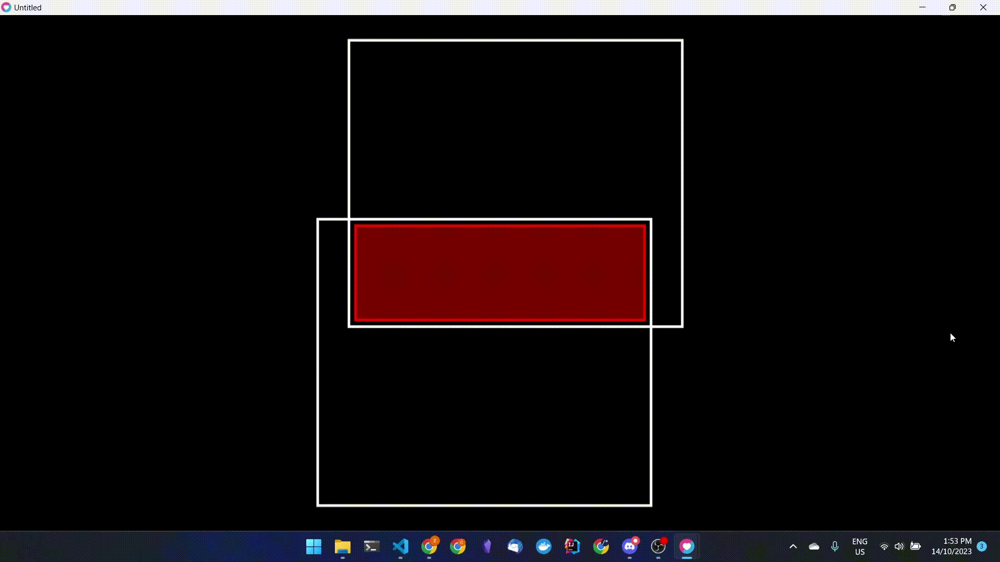
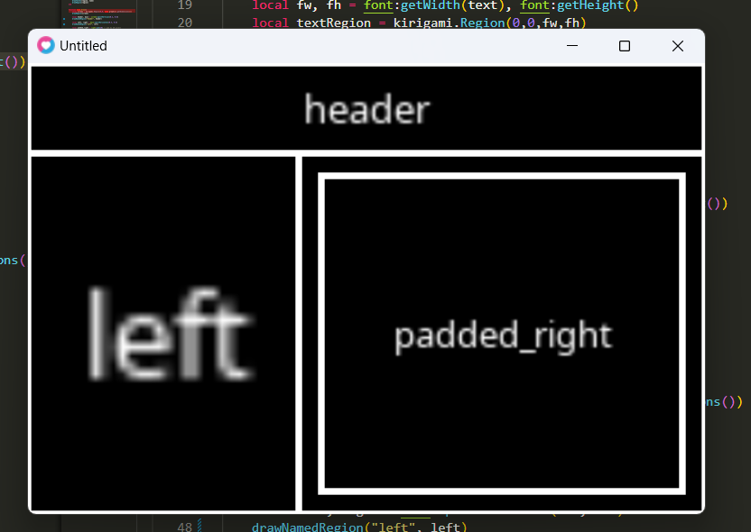

# Kirigami

Kirigami is a rectangle-layout library for lua,
but mainly for use with [love2d.](https://love2d.org)<br/>
It is named after [Japanese kirigami.](https://en.wikipedia.org/wiki/Kirigami)

Kirigami was inspired by [NLay](https://github.com/MikuAuahDark/NPad93#nlay) by [MikuAuahDark](https://github.com/MikuAuahDark/).

It works great with [Inky!](https://github.com/Keyslam/Inky)

----------------


------------------



----------------

## Simple example with code:



```lua

function love.draw()
    local screen = kirigami.Region(0,0, love.graphics.getDimensions())
    drawRegion(screen)

    local header, main = screen:splitVertical(0.2, 0.8)
    namedRegion("header", header)

    local left, right = main:splitHorizontal(0.4, 0.6)
    namedRegion("left", left)

    local padded_right = right:pad(20) -- pad by 20 pixels
    namedRegion("padded_right", padded_right)
end


```

----------------


# API Reference:
See `API.md` for a basic API reference.<br/>
Or just look through the source code :)

----------------


